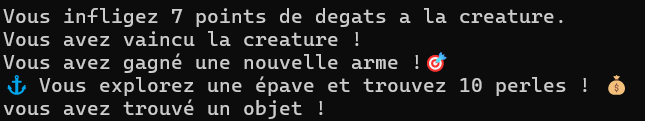
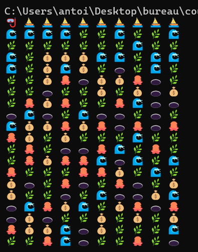

Étape 1 : Génération de Créatures Marines🔄  
. Types de créatures   
. Structure de données suggérée  
. Génération  

Étape 2 : Système d'Attaque du Plongeur✅  
. Ressources du joueur  
. Interface de combat (exemple)  
. Mécaniques de combat  

Étape 3 : Attaque des Créatures Marines✅  
. Ordre d'attaque  
. Effets spéciaux des créatures  
. Conséquences des attaques subies  
. Ordre des actions par tour  

Étape 4 : Système de Récompenses Marines✅  
. Interface de récompense (exemple)  

. Types de récompenses  
. Gestion d'inventaire (exemple)  

Étape 5 : Sauvegarde et Chargement🔄  
. Données à sauvegarder  
. Contraintes  
. Exemple de structure de sauvegarde  

Étape 6 : Compétences Aquatiques❌  
. Liste des compétences
. Mécaniques  

Étape 7 : Cartographie des Océans✅  
. Interface de carte  

. Types de zones  

. Mécaniques d'exploration

Bonus Possibles❌  
. Système de Progression  
. Commerce Sous-Marin  
. Défis Spéciaux  
. Amélioration Interface  

légende :   
non commencé -> ❌  
en cours -> 🔄  
terminé -> ✅

### Difficultés rencontrées : 

# Combat : 

    La première difficulté rencontrée s'est déroulé pendant l'implémentation du système de combat. Le plus dur a été de faire l'affichage. Il a fallu faire en sorte de passer en paramètres le message pour que l'affichage se fasse de manière automatique et cohérente. De ce fait, pour afficher le combat, seule une fonction est utilisée dans laquelle nous passons en paramètres, les messages à afficher.

    La seconde était l'équilibrage du jeu. Afin d'éviter que le jeu soit trop simple et court ou trop long et monotone, il a fallu trouver des mécaniques pour améliorer le système de combatet de trouver des formules pas trop complexes pour calculer les dégâts infligés, etc.

    Mention spéciale pour les dépendances circulaires : pendant le développement du système de combat, à deux reprises, des dépendances circulaires se sont créées. Pour les résoudre, nous avons dû retirer les #include responsables des dépendances circulaires pour ensuite tagger les structures importantes et puis faire des déclarations anticipées des structures pour pouvoir compiler le projet.

### Améliorations possibles : 

# Combat : 

    Dans la version rendue, nous avons imité du développement objet en mettant les fonctions correspondant à la structure, dans le même fichier.c que la structure. Néanmoins, ces fonctions dépendent d'autres fichiers ce qui ne permet pas de réutiliser les fichier.c comme des modules pour d'autres projets. Cela rend le code moins maintenable et plus difficile à comprendre.
    L'objectif serait que plutôt d'agir directement sur les attributs d'une structure, une valeur ou bien une structure de valeur soit renvoyée par la fonction. L'objectif serait de répondre au principe SOLID ce qui permettrait d'avoir du code clair, maintenable et modulable.
    Cette approche peut être observée dans joueur.c avec les fonctions tels que defense(joueur) ou repos(joueur).
    Exemple de transformation qui pourrait être fait pour respecter le principe SOLID : 
    int attaqueLegere(Plongeur* joueur, CreatureMarine* creature);
    deviendrait ->
    int attaqueLegere(Plongeur* joueur);
    => De cette façon, la fonction renvoie uniquement les dégâts calculés de manière brute (sans prise en compte de la défense ennemie) et toute la logique du combat se ferait dans combat.c.

# Affichage :

    Combat : l'affichage actuelle pour le combat est une fonction dans laquelle nous passons en paramètre des chaînes de caractères pour pouvoir faire des affichages plus complexes. L'un des soucis étant que le format d'affichage qui est basé sur le printf et donc sur le calcul d'octet, entre dans un sens en conflit avec l'utilisation des emojis. Les emojis prennent parfois plusieurs octets alors qu'à l'affichage, ils ne prennent que l'espace d'un caractère. Cela entraîne un décale qui peut s'observer par la barre de la boîte de texte qui est en décalage et plus du tout aligner avec les coins.
    Une piste que nous avons explorer mais pas implémenter est l'ajout de la librairie wchar.h qui permettrait de compter le nombre de caractères à afficher pour ensuite l'afficher de façon manuelle par une fonction printf_personnalisée.

